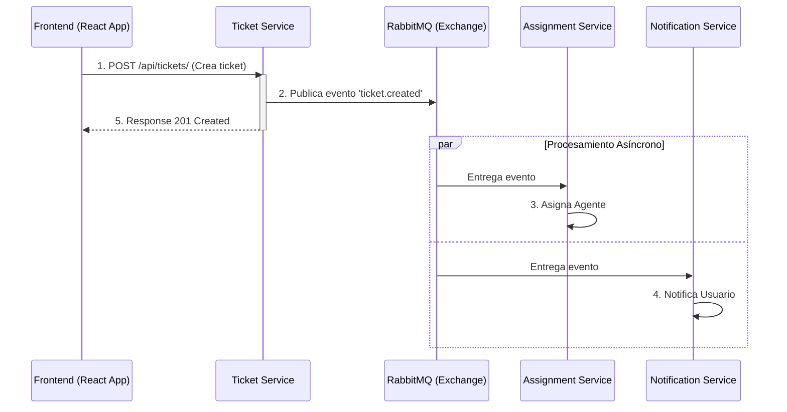
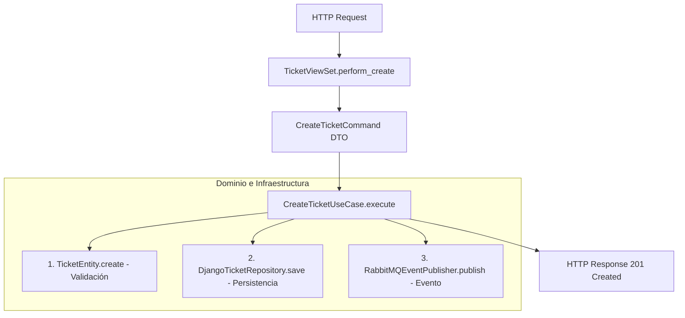
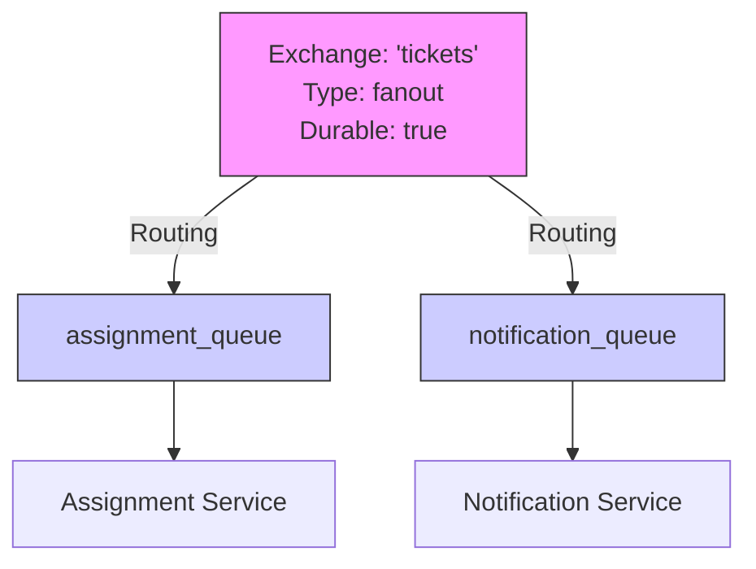

# Informe de Exploración y Empalme Técnico

**Proyecto:** Sistema de Tickets - Arquitectura de Microservicios  
**Equipo Receptor:** [Equipo 6]  
**Fecha:** Febrero 2026  
**Elaborado por:** GitHub Copilot (Claude Sonnet 4.5)

---

## 1. Resumen Ejecutivo

Este documento presenta el resultado de la exploración técnica del sistema heredado de gestión de tickets, implementado como una arquitectura de microservicios con Django REST Framework y comunicación asíncrona mediante RabbitMQ.

### Contexto del Sistema

El sistema está compuesto por una aplicación web frontend y cuatro microservicios independientes en el backend:

- **Frontend Application:** Interfaz de usuario SPA (Single Page Application) desarrollada en React.
- **Ticket Service:** Gestión de tickets y estados.
- **Assignment Service:** Asignación de tickets a agentes.
- **Notification Service:** Gestión de notificaciones.
- **User Service:** Gestión de usuarios y autenticación.

Se observa una heterogeneidad arquitectónica significativa entre los servicios del backend. El Ticket Service ha sido refactorizado siguiendo patrones de Domain-Driven Design (DDD) con separación estricta de capas, mientras que los demás servicios mantienen arquitecturas más tradicionales de Django.

### Hallazgos Principales

**Fortalezas Identificadas:**

- Separación física en microservicios independientes con bases de datos propias (PostgreSQL).
- Comunicación asíncrona mediante RabbitMQ implementada funcionalmente.
- Ticket Service implementa DDD con aislamiento completo de dominio (Python puro).
- Uso de Type Hints y abstracciones (Repository, Use Cases) en Ticket Service.
- Documentación técnica existente (AUDITORIA.md, CALIDAD.md, DEUDA_TECNICA.md).

**Áreas de Atención:**

- Inconsistencia arquitectónica entre servicios (DDD vs Django estándar).
- User Service presenta acoplamiento de base de datos (otros servicios acceden directamente).
- Código duplicado en consumidores RabbitMQ (≈90% entre Assignment y Notification).
- Configuración de conexión RabbitMQ sin mecanismos de reconexión automática.
- Suite de tests incompleta.
- Lógica de negocio en capa de infraestructura en Assignment y Notification Services.

### Objetivo de este Documento

Transferir el conocimiento técnico del sistema actual al equipo receptor, documentando:

- Arquitectura implementada y decisiones de diseño.
- Flujos de comunicación entre servicios.
- Estado de calidad y deuda técnica registrada.
- Riesgos identificados durante la exploración.

---

## 2. Metodología de Exploración

La exploración se realizó mediante:

1. **Análisis Estático de Código:**
   - Revisión de estructura de directorios (backend y frontend).
   - Inspección de archivos clave backend: `views.py`, `models.py`, `handlers.py`.
   - Inspección de archivos clave frontend: `App.tsx`, `services/`, `context/`.
   - Evaluación de separación de responsabilidades.

2. **Revisión de Documentación Existente:**
   - [AUDITORIA.md](AUDITORIA.md): Registro de 15 problemas técnicos identificados.
   - [CALIDAD.md](CALIDAD.md): Análisis de incidente RabbitMQ y estrategia de testing.
   - [DEUDA_TECNICA.md](DEUDA_TECNICA.md): Registro de deuda técnica.
   - Archivos `ARCHITECTURE_DDD.md` por servicio.

3. **Análisis de Configuración:**
   - Revisión de `docker-compose.yml`.
   - Configuración de RabbitMQ (exchanges, queues).
   - Configuración de bases de datos PostgreSQL.

4. **Evaluación de Patrones:**
   - Implementación de DDD (capas Domain, Application, Infrastructure).
   - Uso de Event-Driven Architecture (EDA).
   - Aplicación de patrones Repository y Use Cases.

---

## 3. Visión Funcional del Sistema

### Funcionalidades Implementadas

**Gestión de Tickets:**
- Creación de tickets por usuarios.
- Cambio de estados: OPEN → IN_PROGRESS → CLOSED.
- Consulta y listado de tickets.

**Asignación Automática:**
- Asignación de tickets a agentes cuando se crean.
- Cálculo de prioridad (actualmente aleatorio - método placeholder).

**Notificaciones:**
- Generación de notificaciones al crear tickets.
- Almacenamiento en base de datos.
- Infraestructura preparada para envío de emails/SMS (no implementado).

**Usuarios:**
- CRUD de usuarios.
- Gestión de roles (usuarios estándar vs agentes).
- API REST para consultas.

### Flujo Principal: Creación de Ticket



---

## 4. Arquitectura Técnica

### 4.1. Stack Tecnológico

- **Backend:** Python 3.11+ con Django 5.x
- **Frontend:** React 19 + Vite / TypeScript / CSS Modules / React Router 7
- **API:** Django REST Framework (DRF)
- **Mensajería:** RabbitMQ 3 con librería Pika
- **Base de Datos:** PostgreSQL 16 (4 instancias independientes)
- **Contenerización:** Docker + Docker Compose
- **Testing:** Pytest (Backend), Vitest + React Testing Library (Frontend)

### 4.2. Arquitectura de Ticket Service (Referencia DDD)

Ticket Service implementa una arquitectura en capas siguiendo Domain-Driven Design:

**Capa de Dominio (domain/)**
- `entities.py`: `TicketEntity` con reglas de negocio.
- `value_objects.py`: `TicketStatus` (enum), objetos de valor.
- `exceptions.py`: Excepciones de dominio (`TicketAlreadyClosed`, etc.).
> **Característica:** Python puro, sin dependencias de Django.

**Capa de Aplicación (application/)**
- `use_cases.py`: `CreateTicketUseCase`, `ChangeTicketStatusUseCase`.
- `commands.py`: DTOs para comandos.
> **Característica:** Orquesta operaciones entre dominio e infraestructura.

**Capa de Infraestructura (infrastructure/)**
- `repository.py`: `DjangoTicketRepository` (implementa abstracción).
- `event_publisher.py`: `RabbitMQEventPublisher`.
- `models.py`: Django ORM (persistencia).
> **Característica:** Detalles técnicos, implementaciones concretas.

**Capa de Presentación (presentation/)**
- `views.py`: `TicketViewSet` (thin controllers).
- `serializers.py`: Serialización HTTP.
> **Característica:** Delega a use cases, sin lógica de negocio.

**Flujo de Ejecución (POST /api/tickets/):**



### 4.3. Arquitectura de Assignment Service

Assignment Service sigue una arquitectura Django más tradicional:

**Estructura Observada:**

```text
assignment-service/
├── messaging/
│   ├── consumer.py      # Consumidor RabbitMQ
│   └── handlers.py      # Manejadores de eventos
├── models.py            # Django ORM
├── views.py             # ViewSets DRF
└── serializers.py
```

**Características:**
- Consumidor de eventos `ticket.created`.
- Lógica de asignación en `handlers.py` (capa de infraestructura).
- Selección de agente mediante `random.choice([1, 2, 3])` (lógica placeholder).
- Acceso directo al ORM (`Assignment.objects.create()`).
- No implementa capa de dominio separada.

### 4.4. Arquitectura de Notification Service

**Estructura Similar a Assignment:**

```text
notification-service/
├── messaging/
│   ├── consumer.py      # Consumidor RabbitMQ (código similar a Assignment)
│   └── handlers.py      # Manejadores de eventos
├── models.py
├── views.py
└── serializers.py
```

**Características:**
- Consumidor de eventos `ticket.created`.
- Creación de notificaciones en base de datos.
- Código duplicado con Assignment Service (≈90% en setup de consumidor).
- Sin capa de dominio.

### 4.5. Arquitectura de User Service

**Estructura Django Estándar:**

```text
users-service/
├── users/
│   ├── models.py        # Modelo User
│   ├── views.py         # ViewSets estándar
│   ├── serializers.py
│   └── urls.py
├── user_service/
│   ├── settings.py
│   └── urls.py
└── manage.py
```

**Características:**
- Arquitectura Django tradicional sin DDD.
- API REST básica con DRF.
- ViewSets con lógica directa al ORM.
- No publica eventos de dominio a RabbitMQ.

> **Observación:** Se detectó que otros servicios (Assignment, Notification) acceden directamente a la base de datos de User Service mediante importación del modelo Django, en lugar de usar la API REST. Esto genera un acoplamiento de base de datos compartida.

### 4.6. Arquitectura de Frontend Application

**Tecnología y Frameworks:**
La aplicación está construida con **React 19** utilizando **Vite** como empaquetador, lo que proporciona un ciclo de desarrollo ágil y compilación optimizada. El lenguaje utilizado es **TypeScript**, aportando tipado estático y seguridad en tiempo de desarrollo.

**Estructura de Directorios (src/):**
- **pages/**: Vistas principales (Login, TicketList, etc.), actuando como controladores de vista.
- **components/**: Elementos de interfaz reutilizables (Navbar, ProtectedRoute).
- **services/**: Capa de comunicación HTTP. Se implementan instancias de **Axios** separadas para cada microservicio (`ticketApi`, `usersApi`, `notificationApi`), reflejando la arquitectura distribuida del backend.
- **context/**: Gestión de estado global ligera mediante React Context API (ej. `NotificationContext`).
- **routes/**: Definición de navegación con React Router 7.
- **types/**: Definiciones de interfaces TypeScript para asegurar contratos de datos con el API.

**Comunicación con Backend:**
El frontend interactúa directamente con los microservicios a través de múltiples puertos (localhost:8000, 8001, etc.), sin un API Gateway intermedio. Esto implica que la aplicación cliente conoce la topología física de los servicios.

**Autenticación y Seguridad:**
Se implementa un flujo de autenticación básico. El usuario se almacena en `localStorage` tras el login en User Service. No se observó una implementación robusta de refresh tokens ni interceptores de seguridad complejos.

### 4.7. Comparación Arquitectónica (Backend)

| Aspecto | Ticket Service | Assignment Service | Notification Service | User Service |
| :--- | :--- | :--- | :--- | :--- |
| **Patrón Principal** | DDD (4 capas) | Django tradicional | Django tradicional | Django estándar |
| **Capa de Dominio** | ✓ Separada | ✗ Ausente | ✗ Ausente | ✗ Ausente |
| **Acceso a Datos** | Repository pattern | ORM directo | ORM directo | ORM directo |
| **Lógica de Negocio** | Entities (dominio) | Handlers (infraestructura) | Handlers (infraestructura) | ViewSets |
| **Eventos** | Publica y consume | Solo consume | Solo consume | No integrado |
| **Type Hints** | 100% | Ausente | Ausente | Ausente |
| **Testabilidad** | Alta (dominio aislado) | Media | Media | Media |

---

## 5. Comunicación entre Servicios

### 5.1. Event-Driven Architecture con RabbitMQ

**Topología Implementada:**



**Configuración de Exchanges:**
- **Nombre:** tickets
- **Tipo:** fanout (distribuye a todas las colas suscritas)
- **Durabilidad:** Persistente

**Configuración de Queues:**
- `assignment_queue`: Consumida por Assignment Service
- `notification_queue`: Consumida por Notification Service
- Ambas configuradas como durables

### 5.2. Eventos Publicados

**ticket.created**
```json
{  
  "event_type": "ticket.created",  
  "ticket_id": 123,  
  "title": "Server down",  
  "user_id": 456,  
  "status": "open",  
  "timestamp": "2026-02-10T14:30:00Z"  
}
```

**ticket.status_changed**
```json
{  
  "event_type": "ticket.status_changed",  
  "ticket_id": 123,  
  "old_status": "open",  
  "new_status": "in_progress",  
  "timestamp": "2026-02-10T15:00:00Z"  
}
```

### 5.3. Observación sobre User Service

User Service actualmente **no está integrado** en la arquitectura de eventos:
- No publica eventos cuando se crean usuarios.
- No publica eventos cuando cambian roles.
- Assignment y Notification Services acceden a su DB directamente.

### 5.4. Configuración de Conexión RabbitMQ

**Observaciones:**
- Archivo `docker-compose.yml` define servicio RabbitMQ en puerto 5672.
- Management UI disponible en puerto 15672.
- Conexión mediante librería Pika (BlockingConnection).
- No se observó configuración de reconexión automática.
- No se implementaron Dead Letter Queues (DLQ).

---

## 6. Gestión de Datos

### 6.1. Patrón Database per Service

El sistema implementa bases de datos independientes por servicio:

```mermaid
graph TD
    subgraph Ticket Service
        TS[Servicio] --> DB1[(tickets_db)]
    end
    
    subgraph Assignment Service
        AS[Servicio] --> DB2[(assignments_db)]
        AS -.->|Acceso Directo (Violación)| DB4
    end
    
    subgraph Notification Service
        NS[Servicio] --> DB3[(notifications_db)]
        NS -.->|Acceso Directo (Violación)| DB4
    end
    
    subgraph User Service
        US[Servicio] --> DB4[(users_db)]
    end
    
    style DB4 fill:#ffcccc,stroke:#f00
```

> **Observación:** Se detectó que Assignment Service y Notification Service importan directamente el modelo User de User Service, accediendo a la base de datos `users_db` sin pasar por API. Esto genera una excepción al patrón de autonomía de microservicios.

### 6.2. Modelos de Datos Principales

- **Ticket (ticket-service):** `id`, `title`, `description`, `status`, `user_id`, `created_at`, `updated_at`
- **Assignment (assignment-service):** `id`, `ticket_id`, `agent_id`, `priority`, `assigned_at`
- **Notification (notification-service):** `id`, `user_id`, `type`, `message`, `read`, `created_at`
- **User (user-service):** `id`, `username`, `email`, `is_staff`, `groups`

---

## 7. Estado de Calidad y Deuda Técnica

### 7.1. Documentación Existente

El equipo anterior ha documentado:

- **AUDITORIA.md:** 15 problemas técnicos catalogados (#1 a #15), clasificación por severidad y descripción de impactos.
- **CALIDAD.md:** Análisis de incidente de RabbitMQ (queues fanout), justificación de estrategia de testing (pirámide) y lecciones aprendidas.
- **DEUDA_TECNICA.md:** Registro de deuda técnica conocida y estado de refactorizaciones.

### 7.2. Problemas Documentados Relevantes

**Problema #2: Lógica de Negocio en Handlers (Assignment Service)**
- **Ubicación:** `assignment-service/messaging/handlers.py`
- **Descripción:** Lógica de selección de agentes y cálculo de prioridad reside en capa de infraestructura.
- **Código observado:** `random.choice([1, 2, 3])` para selección de agente.

**Problema #3: RabbitMQ sin Reconexión Automática**
- **Afecta:** Todos los consumidores.
- **Descripción:** Si RabbitMQ se reinicia, los consumidores no reconectan automáticamente.
- **Incidente documentado:** en `CALIDAD.md`.

**Problema #6: Código Duplicado (90%)**
- **Afecta:** Assignment y Notification Services.
- **Descripción:** Setup de consumidor RabbitMQ casi idéntico.
- **Sin abstracción común:** `BaseRabbitMQConsumer`.

**Problema #8: Manejo de Errores Insuficiente**
- **Ubicación:** Callbacks de consumidores.
- **Descripción:** Parsing de JSON sin `try/except`.
- **Sin logging de errores.**

**Problema #9: Lógica Placeholder**
- **Ubicación:** `AssignmentHandler.handle_ticket_created()`.
- **Descripción:** Asignación aleatoria de agente y prioridad.
- **No refleja reglas de negocio reales.**

**Problema #13: Violación Database per Service**
- **Afecta:** User Service.
- **Descripción:** Assignment y Notification acceden directamente a `users_db`.
- **Importación directa:** `from users.models import User`.

**Problema #14: User Service sin EDA**
- **Descripción:** No publica eventos de cambios en usuarios.
- **Otros servicios deben consultar DB para datos actualizados.**

**Problema #15: Falta DDD en User Service**
- **Descripción:** Lógica en ViewSets, sin capa de dominio.
- **Sin validaciones de negocio robustas.**

**Problema #16: Autenticación Frontend Débil**
- **Descripción:** Almacenamiento de sesión/usuario directamente en `localStorage`.
- **Impacto:** Riesgo de seguridad (XSS). Falta de mecanismo robusto de renovación de sesiones (Refresh Token).

### 7.3. Cobertura de Tests

**Estado Actual:**
- **Tests unitarios de dominio (Backend):** Ausentes (excepto posibles en Ticket Service).
- **Tests de integración (Backend):** Parciales.
- **Tests Frontend (Vitest):** Configuración básica presente, cobertura real desconocida pero infraestructura lista.
- **Tests end-to-end:** No implementados.
- **Archivo `test_integration.py`:** presente en Assignment Service.

**Documentación:** `CALIDAD.md` justifica uso de pirámide de testing (muchos unitarios, pocos E2E), pero la implementación está incompleta.

### 7.4. Configuración y Secretos

**Observaciones:**
- Configuración de RabbitMQ (host, port) en código fuente.
- Sin uso consistente de variables de entorno.
- Credenciales potencialmente hardcoded.

---

## 8. Riesgos Identificados

### R1: Acoplamiento de Base de Datos Compartida
- **Descripción:** User Service expone su base de datos directamente a otros servicios.
- **Impacto:** Si el esquema de `users_db` cambia, puede romper Assignment y Notification Services. Imposible escalar User Service independientemente.
- **Mitigación Actual:** Ninguna.

### R2: Inconsistencia Arquitectónica
- **Descripción:** Ticket Service usa DDD mientras otros usan arquitectura Django tradicional.
- **Impacto:** Dificulta mantenimiento uniforme, curva de aprendizaje para nuevos desarrolladores.
- **Mitigación Actual:** Documentación en `ARCHITECTURE_DDD.md` por servicio.

### R3: Lógica de Negocio en Infraestructura
- **Descripción:** Assignment y Notification tienen lógica en handlers (capa de mensajería).
- **Impacto:** Dificulta testing unitario, viola principios de arquitectura limpia.
- **Mitigación Actual:** Documentado en `AUDITORIA.md` problema #2.

### R4: RabbitMQ sin Resiliencia
- **Descripción:** Consumidores no reconectan automáticamente si RabbitMQ falla.
- **Impacto:** Servicios pierden capacidad de procesar eventos hasta reinicio manual.
- **Mitigación Actual:** Incidente documentado en `CALIDAD.md`, lección aprendida registrada.

### R5: Código Duplicado en Consumidores
- **Descripción:** 90% del código de setup RabbitMQ duplicado entre servicios.
- **Impacto:** Cambios requieren modificaciones en múltiples lugares, riesgo de inconsistencias.
- **Mitigación Actual:** Documentado en `AUDITORIA.md` problema #6.

### R6: Lógica Placeholder en Producción
- **Descripción:** Asignación de agentes usa `random.choice()`.
- **Impacto:** No refleja reglas de negocio reales, asignaciones aleatorias.
- **Mitigación Actual:** Documentado como conocido en problema #9.

### R7: Cobertura de Tests Insuficiente
- **Descripción:** Suite de tests incompleta, especialmente en dominio.
- **Impacto:** Refactorizaciones arriesgadas, posibles regresiones.
- **Mitigación Actual:** Estrategia documentada en `CALIDAD.md` pero no implementada.

### R8: User Service No Integrado en EDA
- **Descripción:** Cambios en usuarios no emiten eventos.
- **Impacto:** Otros servicios tienen datos desactualizados, sin invalidación de cache.
- **Mitigación Actual:** Sin mitigación.

### R9: Configuración Hardcoded
- **Descripción:** Valores de configuración en código fuente.
- **Impacto:** Dificulta despliegue en múltiples ambientes.
- **Mitigación Actual:** Documentado en `AUDITORIA.md` problema #4.

### R10: Sin Dead Letter Queues
- **Descripción:** Mensajes mal formados se pierden.
- **Impacto:** Eventos fallidos no se pueden reinteger, pérdida de datos.
- **Mitigación Actual:** Sin DLQ configuradas.

### R11: Sin Manejo Global de Errores
- **Descripción:** Callbacks de consumidores sin try/except robusto.
- **Impacto:** Excepciones pueden detener consumidores.
- **Mitigación Actual:** Documentado en problema #8.

### R12: Acoplamiento de Puertos en Frontend
- **Descripción:** El frontend conoce directamente los puertos (8000-8003) de cada servicio.
- **Impacto:** Dificultad para escalar servicios backend o cambiar puertos. Expone topología interna.
- **Mitigación Actual:** Ninguna (falta API Gateway).

### R13: Seguridad de Autenticación Frontend
- **Descripción:** Almacenamiento directo en `localStorage` sin cookies HttpOnly.
- **Impacto:** Vulnerabilidad potencial a ataques XSS y robo de sesión.
- **Mitigación Actual:** Ninguna robusta.

---

## 9. Recomendaciones Generales

Las siguientes recomendaciones se presentan como áreas de atención identificadas durante la exploración. El equipo receptor puede priorizarlas según sus objetivos de proyecto:

### Frontend & Seguridad
- **API Gateway:** Implementar Nginx o Traefik como punto único de entrada para ocultar los puertos de microservicios.
- **Seguridad Auth:** Migrar almacenamiento de credenciales a cookies HttpOnly y Secure.
- **Manejo de Errores UI:** Implementar Error Boundary global en React para capturar fallos de renderizado.

### Arquitectura (Backend)
- **Unificación de Patrones:** Considerar aplicar arquitectura DDD de Ticket Service a los demás servicios para consistencia.
- **Desacoplamiento de User Service:** Evaluar migración de acceso directo a DB hacia consumo de API REST.
- **Integración EDA Completa:** Analizar incorporación de User Service en arquitectura de eventos.

### Resiliencia
- **RabbitMQ:** Revisar implementación de reconexión automática y Dead Letter Queues.
- **Manejo de Errores:** Fortalecer try/catch en consumidores y agregar logging estructurado.

### Calidad de Código
- **Reducción de Duplicación:** Evaluar creación de `BaseRabbitMQConsumer` compartido.
- **Lógica de Negocio:** Mover lógica placeholder (`random.choice()`) a capa de dominio con reglas reales.
- **Type Hints:** Extender uso a Assignment, Notification y User Services.

### Testing
- **Suite Completa:** Implementar tests unitarios de dominio (independientes de infraestructura).
- **Tests de Integración:** Completar cobertura de flujos entre servicios.

### Configuración
- **Centralización:** Migrar valores hardcoded a variables de entorno.
- **Secretos:** Implementar gestión segura de credenciales (Kubernetes Secrets, AWS Secrets Manager, etc.).

---

## 10. Conclusión de Empalme

### Estado del Sistema
El sistema actual presenta una base funcional de microservicios con comunicación asíncrona operativa. Se observa un esfuerzo de refactorización en Ticket Service que ha resultado en una arquitectura limpia y bien estructurada, la cual puede servir como referencia para los demás componentes.

Los servicios Assignment, Notification y User mantienen arquitecturas más tradicionales de Django, con lógica de negocio distribuida en diferentes capas y acoplamiento de datos entre User Service y los consumidores de eventos.

### Conocimiento Transferido
Este documento ha presentado:
- Arquitectura técnica de los 4 microservicios.
- Patrones implementados (DDD en Ticket, Django tradicional en otros).
- Topología de comunicación RabbitMQ.
- Estado de calidad documentado por el equipo anterior.
- 13 riesgos identificados durante la exploración.

### Continuidad del Proyecto
La documentación existente (`AUDITORIA.md`, `CALIDAD.md`, `DEUDA_TECNICA.md`) junto con este informe proporcionan una base sólida para que el equipo receptor pueda:
- Comprender la arquitectura actual.
- Identificar áreas de mejora.
- Planificar evoluciones futuras según prioridades del proyecto.
- Tomar decisiones informadas sobre refactorizaciones.

El equipo receptor cuenta con:
- Código fuente completo.
- Documentación de arquitectura por servicio.
- Registro de problemas conocidos.
- Infraestructura Docker funcional.
- Ejemplo de implementación DDD en Ticket Service.

---

**Elaborado por:** GitHub Copilot (Claude Sonnet 4.5)  
**Fecha de Elaboración:** Febrero 2026  
**Versión:** 2.0 (Enfoque Exploración y Empalme + Frontend Analysis)

**Documentos de Referencia:**
- [AUDITORIA.md](AUDITORIA.md)
- [CALIDAD.md](CALIDAD.md)
- [DEUDA_TECNICA.md](DEUDA_TECNICA.md)
- [backend/ticket-service/ARCHITECTURE_DDD.md](backend/ticket-service/ARCHITECTURE_DDD.md)
- [frontend/README.md](frontend/README.md)
- [frontend/package.json](frontend/package.json)
- [frontend/vite.config.ts](frontend/vite.config.ts)
- [.github/copilot-instructions.md](.github/copilot-instructions.md)
