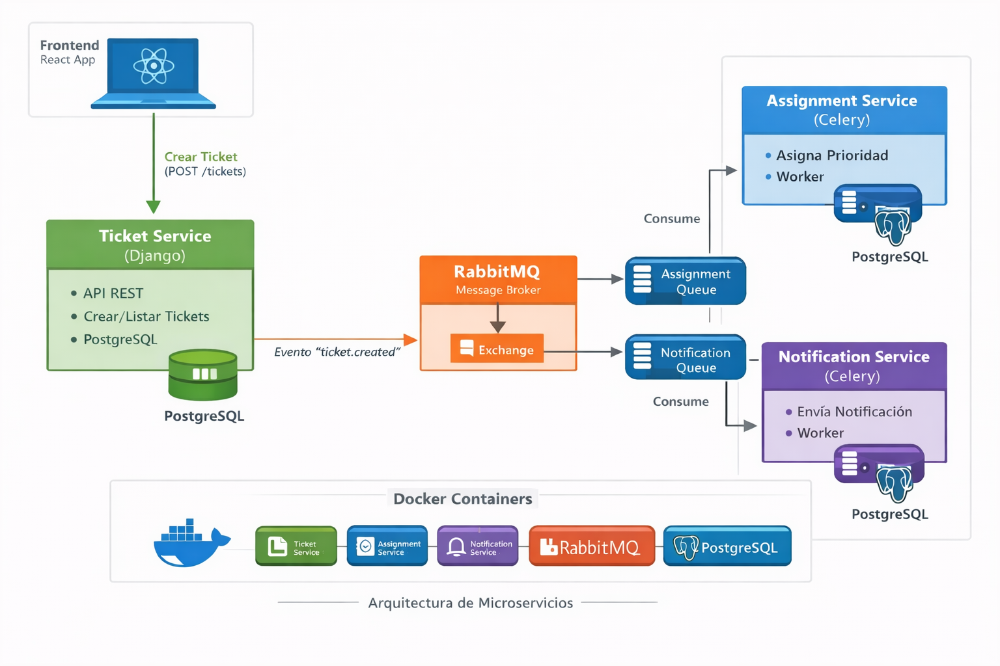

# Sistema de Tickets – Arquitectura de Microservicios

## 📖 Descripción general

Este proyecto implementa un **Sistema de Gestión de Tickets** basado en una **arquitectura de microservicios**, utilizando **Django** para el backend, **React + TypeScript + Vite** para el frontend, **PostgreSQL** como base de datos, **RabbitMQ** como broker de mensajería y **Docker / Docker Compose** para la contenerización.

El sistema sigue un enfoque **Domain-Driven Design (DDD)** combinado con **Event-Driven Architecture (EDA)**, donde los microservicios se comunican de manera **asíncrona** mediante eventos publicados y consumidos a través de RabbitMQ. Esto permite bajo acoplamiento, escalabilidad, testabilidad y una arquitectura cercana a escenarios reales de producción.

---

## 🏗️ Principios Arquitectónicos

Este proyecto implementa las siguientes prácticas modernas:

* **Domain-Driven Design (DDD)**: Arquitectura en capas con dominio puro, casos de uso y adaptadores de infraestructura
* **Event-Driven Architecture (EDA)**: Comunicación asíncrona desacoplada mediante eventos de dominio
* **Principios SOLID**: Código mantenible, testeable y extensible
* **Database per Service**: Cada microservicio tiene su propia base de datos PostgreSQL
* **API Gateway Pattern**: Frontend consume APIs REST de múltiples servicios
* **Quality Gates**: Validación de calidad asistida por IA antes de cada commit

---

## 🧩 Arquitectura del sistema

El sistema está compuesto por **cuatro microservicios backend independientes** y un frontend desacoplado.

### 1️⃣ Ticket Service (Puerto 8000)

* Expone una **API REST** completa (CRUD de tickets)
* Permite **crear, listar, actualizar y eliminar tickets**
* Persiste la información en PostgreSQL
* Publica el evento **`ticket.created`** cuando se registra un nuevo ticket
* Actúa como **producer** de eventos
* Arquitectura DDD con dominio puro, casos de uso y repositorios

### 2️⃣ Assignment Service (Puerto 8002)

* Expone **API REST** para consultar asignaciones
* Consume el evento **`ticket.created`**
* Asigna tickets a agentes según **reglas de negocio** definidas en el dominio
* Procesa los eventos de forma asíncrona mediante consumidores
* Mantiene su propia base de datos PostgreSQL
* Refactorizado completamente a DDD con casos de uso y repositorios
* Incluye validaciones de dominio y eventos de dominio

### 3️⃣ Notification Service (Puerto 8001)

* Expone una **API REST** para consultar y gestionar notificaciones
* Consume el evento **`ticket.created`**
* Registra notificaciones cuando se crea un ticket
* Permite **marcar notificaciones como leídas** (idempotente)
* Procesa eventos de forma independiente
* Arquitectura DDD con reglas de negocio en el dominio
* Base de datos PostgreSQL independiente

### 4️⃣ Users Service (Puerto 8003)

* Expone **API REST** para gestión de usuarios
* Manejo completo de usuarios (CRUD)
* Autenticación y autorización
* Eventos de dominio (`user.created`, `user.deactivated`)
* Arquitectura DDD completa
* Base de datos PostgreSQL independiente

### 🎨 Frontend

* Implementado con **React 19 + TypeScript + Vite**
* **Autenticación completa**: Login y registro de usuarios
* Consume APIs REST de múltiples servicios (Tickets, Notifications, Assignments, Users)
* Diseño moderno con gradientes, animaciones y efectos visuales
* Responsive design
* No tiene conocimiento de RabbitMQ ni de los eventos asíncronos
* Totalmente desacoplado del backend asíncrono

---

## 🔄 Comunicación asíncrona

### RabbitMQ con Fanout Exchange

RabbitMQ actúa como **broker de mensajería**, utilizando un patrón **fanout exchange** que permite:

* **Desacoplar los microservicios** (productores no conocen a consumidores)
* **Distribuir eventos a múltiples consumidores** sin competencia
* **Aumentar la tolerancia a fallos** (si un servicio cae, los demás siguen funcionando)
* **Escalabilidad horizontal** (múltiples instancias pueden consumir del mismo exchange)

El **Ticket Service** publica el evento `ticket.created` en un **exchange tipo fanout**, el cual **replica** el mensaje a:

* Cola del **Assignment Service**
* Cola del **Notification Service**

Cada servicio consume el evento de forma **independiente y asíncrona**, con sus propios **consumidores dedicados**.

### Consumers Dedicados

Cada microservicio consumidor tiene:

* Un **contenedor dedicado** para el consumer (separado del servidor API)
* **Procesamiento asíncrono** sin bloquear el servidor principal
* **Reintentos automáticos** (`restart: on-failure`)
* **Handlers idempotentes** para evitar procesamiento duplicado

---



## 🛠️ Tecnologías utilizadas

### Backend

* **Python 3.11+**
* **Django 5.x** - Framework web principal
* **Django REST Framework** - APIs RESTful
* **Pika** - Cliente Python para RabbitMQ
* **psycopg2** - Adaptador PostgreSQL

### Frontend

* **React 19** - Framework UI moderno
* **TypeScript** - Tipado estático
* **Vite** - Build tool y dev server
* **React Router v7** - Navegación
* **Axios** - Cliente HTTP

### Infraestructura

* **PostgreSQL 16** - Base de datos relacional (una por servicio)
* **RabbitMQ 3 Management** - Message broker con interfaz web
* **Docker** - Contenerización
* **Docker Compose** - Orquestación multi-contenedor

### DevOps y Calidad

* **AI-Assisted Quality Gates** - Validación de código con IA
* **Testing Pyramid** - Estrategia de testing (unitarias > integración > E2E)
* **DDD Pattern Validation** - Scripts de verificación de arquitectura

---

## 📁 Estructura del proyecto

```text
SistemaTickets/
├── backend/
│   ├── ticket-service/          # Puerto 8000 - Gestión de tickets
│   │   ├── tickets/             # App principal con DDD
│   │   │   ├── domain/          # Entidades, value objects, reglas
│   │   │   ├── application/     # Casos de uso
│   │   │   └── infrastructure/  # Repositorios, adaptadores
│   │   ├── messaging/           # Publicación de eventos
│   │   └── manage.py
│   │
│   ├── assignment-service/      # Puerto 8002 - Asignación de tickets
│   │   ├── assignments/         # App principal con DDD
│   │   │   ├── domain/          # Reglas de asignación
│   │   │   ├── application/     # Casos de uso de asignación
│   │   │   └── infrastructure/  # Repositorios
│   │   ├── messaging/           # Consumo de eventos
│   │   └── verify_ddd.py        # Script de validación DDD
│   │
│   ├── notification-service/    # Puerto 8001 - Notificaciones
│   │   ├── notifications/       # App principal con DDD
│   │   │   ├── domain/          # Reglas de notificación
│   │   │   ├── application/     # Casos de uso
│   │   │   ├── infrastructure/  # Repositorios
│   │   │   └── messaging/       # Consumo de eventos
│   │   └── manage.py
│   │
│   └── users-service/           # Puerto 8003 - Gestión de usuarios
│       ├── users/               # App principal con DDD
│       │   ├── domain/          # Entidades de usuario
│       │   ├── application/     # Casos de uso de autenticación
│       │   └── infrastructure/  # Repositorios
│       └── manage.py
│
├── frontend/                    # Puerto 5173 - Interface web
│   ├── src/
│   │   ├── components/          # Componentes reutilizables
│   │   ├── pages/               # Páginas (Login, Register, Tickets, etc.)
│   │   ├── routes/              # Configuración de rutas
│   │   ├── services/            # Clientes API (Axios)
│   │   ├── types/               # Definiciones TypeScript
│   │   └── context/             # State management
│   └── vite.config.ts
│
├── docker-compose.yml           # Orquestación de servicios
├── AI_WORKFLOW.md               # Flujo de trabajo con IA
├── AUDITORIA.md                 # Auditoría de calidad y SOLID
├── CALIDAD.md                   # Lecciones learned y testing pyramid
└── DEUDA_TECNICA.md             # Registro de deuda técnica

```

**Características clave de la estructura:**

* Cada microservicio es un **proyecto Django independiente**
* Cada servicio tiene su **propia base de datos PostgreSQL**
* Arquitectura **DDD** en capas (domain, application, infrastructure)
* Separación física de **API servers** y **event consumers** en Docker
* Documentación completa por servicio (ARCHITECTURE_DDD.md, README.md, etc.)

---

## ⚙️ Requisitos previos

* Docker
* Docker Compose
* Git

> ⚠️ No es necesario instalar Python ni Node.js localmente si el proyecto se ejecuta completamente con Docker.

---

## 🚀 Instalación y ejecución

### 1️⃣ Clonar el repositorio

```bash
git clone <url-del-repositorio>
cd SistemaTickets
```

### 2️⃣ Crear archivo de entorno (opcional)

Crear un archivo `.env` en la raíz del proyecto si necesitas personalizar variables:

```env
# Ejemplo de variables opcionales
RABBITMQ_HOST=rabbitmq
DJANGO_DEBUG=True
```

### 3️⃣ Construir y levantar los contenedores

```bash
# Construir todas las imágenes
docker-compose build

# Levantar todos los servicios
docker-compose up
```

O de forma separada:

```bash
# Levantar solo infraestructura
docker-compose up -d db rabbitmq

# Levantar servicios backend
docker-compose up -d backend assignment-service notification-service users-service

# Levantar consumers
docker-compose up -d assessment-consumer notification-consumer

# Levantar frontend
docker-compose up frontend
```

### 4️⃣ Verificar que todo funciona

Una vez levantados los servicios, verifica:

* **Frontend** accesible en http://localhost:5173
* **RabbitMQ Management** accesible en http://localhost:15672
* **APIs** respondiendo en sus respectivos puertos

---

## 🌐 Accesos y puertos

### Servicios Web

* **Frontend:** http://localhost:5173
  * Páginas: `/login`, `/register`, `/tickets`, `/notifications`
  
### APIs Backend

* **Ticket Service API:** http://localhost:8000/api/tickets/
* **Notification Service API:** http://localhost:8001/api/notifications/
* **Assignment Service API:** http://localhost:8002/api/assignments/
* **Users Service API:** http://localhost:8003/api/users/

### Infraestructura

* **RabbitMQ Management:** http://localhost:15672
  * Usuario: `guest`
  * Contraseña: `guest`
  
### Bases de Datos PostgreSQL

* **Ticket DB:** `localhost:5432` (sistema_tickets)
* **Assignment DB:** `localhost:5433` (assessment_db)
* **Notification DB:** `localhost:5434` (notifications_db)
* **Users DB:** `localhost:5435` (users_db)

---

## 🔄 Actualización del software

Cuando existan cambios en el código:

```bash
git pull
docker-compose down
docker-compose build
docker-compose up
```

Si solo hay cambios de código (sin nuevas dependencias):

```bash
docker-compose restart
```

Para reconstruir un servicio específico:

```bash
# Ejemplo: reconstruir solo notification-service
docker-compose build notification-service
docker-compose up -d notification-service
```

Para ver logs de un servicio específico:

```bash
docker-compose logs -f notification-service
docker-compose logs -f notification-consumer
```

---

## ▶️ Uso del sistema

### Flujo principal - Creación de ticket

1. El usuario **inicia sesión** desde el frontend (`/login`)
2. Navega a **crear ticket** (`/tickets/new`)
3. El frontend envía un `POST` al **Ticket Service** (`http://localhost:8000/api/tickets/`)
4. El Ticket Service:
   * Valida los datos mediante reglas de dominio
   * Guarda el ticket en su base de datos PostgreSQL
   * Publica el evento `ticket.created` a RabbitMQ (fanout exchange)
5. RabbitMQ **replica** el evento a múltiples colas:
   * Cola de **Assignment Service**
   * Cola de **Notification Service**
6. **Assignment Service** (consumer dedicado):
   * Recibe el evento
   * Ejecuta reglas de negocio de asignación
   * Crea un registro de asignación en su propia BD
   * Publica evento `assignment.created`
7. **Notification Service** (consumer dedicado):
   * Recibe el evento
   * Crea una notificación en su propia BD
   * Publica evento `notification.created`
8. El usuario puede consultar:
   * **Tickets** en `/tickets`
   * **Notificaciones** en `/notifications`
   * **Asignaciones** mediante la API del Assignment Service

### Ejemplos de uso de las APIs

#### Crear un ticket

```bash
curl -X POST http://localhost:8000/api/tickets/ \
  -H "Content-Type: application/json" \
  -d '{
    "title": "Error en login",
    "description": "No puedo iniciar sesión con mi usuario",
    "status": "OPEN"
  }'
```

#### Listar notificaciones

```bash
curl http://localhost:8001/api/notifications/
```

#### Marcar notificación como leída (idempotente)

```bash
curl -X PATCH http://localhost:8001/api/notifications/1/read/
```

#### Crear usuario

```bash
curl -X POST http://localhost:8003/api/users/ \
  -H "Content-Type: application/json" \
  -d '{
    "email": "user@example.com",
    "username": "newuser",
    "password": "securepass123"
  }'
```

---

## 🧪 Testing y Calidad

### Pirámide de Testing

El proyecto sigue la **pirámide de testing** (ver [CALIDAD.md](CALIDAD.md)):

```
        /\
       /E2E\         ← Pocas pruebas de extremo a extremo
      /------\
     /Integr.\      ← Pruebas de integración (API + DB)
    /----------\
   / Unitarias  \   ← Mayoría de pruebas (dominio puro)
  /--------------\
```

### Ejecutar tests por servicio

**Ticket Service:**
```bash
cd backend/ticket-service
python manage.py test
```

**Notification Service:**
```bash
cd backend/notification-service
python manage.py test notifications.tests
```

**Assignment Service:**
```bash
cd backend/assignment-service
python manage.py test assignments.tests
```

**Users Service:**
```bash
cd backend/users-service
python manage.py test users.tests
```

### Validación de arquitectura DDD

Cada servicio incluye scripts de validación:

```bash
cd backend/assignment-service
python verify_ddd.py
```

Este script verifica:
* ✅ Estructura de carpetas DDD
* ✅ Independencia del dominio (sin imports de Django)
* ✅ Separación de capas
* ✅ Tests organizados

---

## 📚 Documentación adicional

### Documentación de arquitectura

* **[AI_WORKFLOW.md](AI_WORKFLOW.md)** - Flujo de trabajo con IA como Quality Gate
* **[AUDITORIA.md](AUDITORIA.md)** - Auditoría de deuda técnica y SOLID
* **[CALIDAD.md](CALIDAD.md)** - Lecciones aprendidas y pirámide de testing
* **[DEUDA_TECNICA.md](DEUDA_TECNICA.md)** - Registro de deuda técnica pendiente

### Documentación por servicio

Cada microservicio tiene documentación detallada:

**Ticket Service:**
* [backend/ticket-service/ARCHITECTURE_DDD.md](backend/ticket-service/ARCHITECTURE_DDD.md)
* [backend/ticket-service/QUICK_START_DDD.md](backend/ticket-service/QUICK_START_DDD.md)

**Assignment Service:**
* [backend/assignment-service/INDEX.md](backend/assignment-service/INDEX.md)
* [backend/assignment-service/ARCHITECTURE_DDD.md](backend/assignment-service/ARCHITECTURE_DDD.md)
* [backend/assignment-service/MIGRATION_GUIDE.md](backend/assignment-service/MIGRATION_GUIDE.md)
* [backend/assignment-service/USAGE_GUIDE.md](backend/assignment-service/USAGE_GUIDE.md)

**Notification Service:**
* [backend/notification-service/README.md](backend/notification-service/README.md)
* [backend/notification-service/ARCHITECTURE_DDD.md](backend/notification-service/ARCHITECTURE_DDD.md)
* [backend/notification-service/QUICK_START_DDD.md](backend/notification-service/QUICK_START_DDD.md)

**Users Service:**
* [backend/users-service/README.md](backend/users-service/README.md)
* [backend/users-service/ARCHITECTURE_DDD.md](backend/users-service/ARCHITECTURE_DDD.md)

**Frontend:**
* [frontend/README.md](frontend/README.md)

---

## 🧪 Garantías de calidad

### Separación de responsabilidades

* Cada microservicio:
  * Tiene su **propia base de datos PostgreSQL**
  * No accede a la base de datos de otros servicios
  * Mantiene **independencia funcional y de datos**
  * Implementa **DDD con dominio puro** sin dependencias de frameworks

### Event-Driven Architecture

* Uso de **fanout exchanges** para replicación de eventos
* **Consumers dedicados** separados de los servidores API
* **Idempotencia** en handlers de eventos
* **Reintentos automáticos** en caso de fallo

### Testing

* **Pirámide de testing** aplicada en todos los servicios
* Mayor cantidad de tests unitarios (dominio puro)
* Tests de integración para repositorios y APIs
* Tests E2E para flujos críticos
* Cobertura de reglas de negocio

### Quality Gates con IA

* Validación de código antes de cada commit
* Detección de violaciones SOLID
* Identificación de deuda técnica
* Evaluación de testabilidad
* Ver [AI_WORKFLOW.md](AI_WORKFLOW.md) para más detalles

### Validación de arquitectura

* Scripts automatizados (`verify_ddd.py`)
* Verificación de estructura DDD
* Validación de independencia del dominio
* Checklists de migración y validación

---

## 👥 Roles del equipo

* **Backend Developer 1:** Ticket Service + Users Service
* **Backend Developer 2:** Assignment Service + Notification Service  
* **QA Engineer:** Testing pyramid, validación de flujos EDA, documentación de calidad
* **AI Assistant:** Quality Gate, auditoría SOLID, detección de code smells

---

## 🎯 Logros del proyecto

Este proyecto demuestra:

✅ **Arquitectura de microservicios moderna** con DDD + EDA  
✅ **Comunicación asíncrona real** basada en eventos con RabbitMQ  
✅ **Separación clara de responsabilidades** (domain, application, infrastructure)  
✅ **Database per Service pattern** con PostgreSQL  
✅ **Frontend desacoplado** con React 19 + TypeScript  
✅ **Testing pyramid** bien implementada  
✅ **Quality gates asistidos por IA** para mantener calidad del código  
✅ **Documentación exhaustiva** por servicio y del sistema completo  
✅ **Buenas prácticas de contenerización** con Docker Compose  
✅ **Principios SOLID** aplicados y auditados  
✅ **Idempotencia** en procesamiento de eventos  
✅ **Escalabilidad horizontal** lista (múltiples consumers, multiples instancias)

---

## 📖 Lecciones aprendidas

* **RabbitMQ Fanout vs Queue directa**: Importancia de usar exchanges correctos para broadcast
* **DDD en Python/Django**: Separación física de capas mejora testabilidad y mantenibilidad
* **Event-driven architecture**: Consumers dedicados vs lógica en el servidor API
* **Database per Service**: Independencia completa entre microservicios
* **AI como Quality Gate**: Validación previa detecta problemas antes del commit
* **Testing Pyramid**: Invertir más en tests unitarios de dominio que en E2E

Ver [CALIDAD.md](CALIDAD.md) para análisis detallado de incidentes y lecciones.

---

## 🚧 Próximos pasos

* [ ] Implementar autenticación JWT completa
* [ ] Agregar API Gateway (Kong, Traefik, o NGINX)
* [ ] Implementar Circuit Breaker pattern
* [ ] Agregar observabilidad (Prometheus + Grafana)
* [ ] Implementar tracing distribuido (Jaeger)
* [ ] Agregar tests E2E automatizados
* [ ] Implementar CQRS en servicios complejos
* [ ] Containerizar con Kubernetes
* [ ] Implementar Event Sourcing para auditabilidad

Ver [DEUDA_TECNICA.md](DEUDA_TECNICA.md) para el backlog completo.

---

## 📄 Licencia

Este proyecto es parte de un ejercicio académico/profesional de arquitectura de microservicios.

---

## 🤝 Contribuciones

Para contribuir al proyecto:

1. Leer [AI_WORKFLOW.md](AI_WORKFLOW.md) para entender el flujo de trabajo
2. Revisar [AUDITORIA.md](AUDITORIA.md) para conocer los estándares de calidad
3. Ejecutar validaciones DDD antes de commit
4. Pasar validación de Quality Gate asistido por IA
5. Asegurar que tests pasen (unitarios, integración)
6. Documentar cambios significativos

---

**Sistema de Tickets** - Microservicios con DDD + EDA  
*Arquitectura moderna para sistemas escalables y mantenibles*
